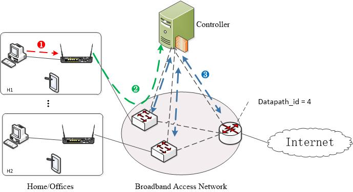

This is the implementation of *Conan*. It is a system which enables content-aware scheduling for applications to improve users' QoE in home network. 
The paper is submmited to Internet-QoE 2016. 

The project includes source codes of *Conan* and a full version paper about *Conan*.

The source codes includes:

- RestRequestAPI.py, provides APIs over HTTP for home gateway.
- consts.py, some basic const used in this project.
- events.py, event for comunication between different components in controller.
- fliter.py, Filter to reject illegal requests. As this is just a demo, so no requests are filtered out.
- newvsctl.py, VSCtl is inherited to add operations of modifying queues.
- simple\_switch\_13.py, it provides routing module.
- policy.py, core scheduling algorithm is implemented here.
- switch.py, forwarding elements abstraction, which includes setting up queue pool for each port
- NIB.py, Information database for each switch.
- request.py, it shows an Restful API example.
- Makefile, scripts to run the application.

This demo topology:

